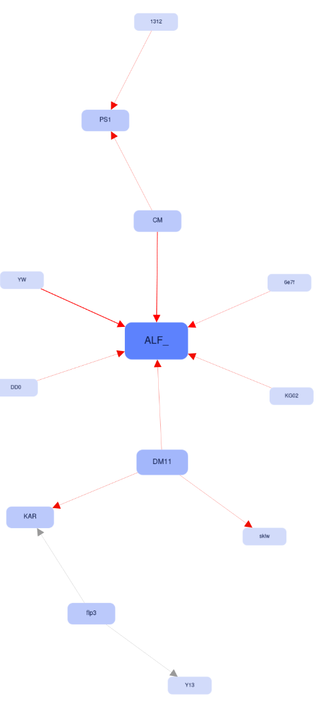

# Meshtastic Network Data Visualization and Processing Tools


> [!TIP]
> **tl;dr** With these programs you can monitor meshtastic nodes via mqtt and visualize the message sources, neighbours, or interactions between nodes. Tested under linux.


Set of tools for processing, storing, and visualizing data from Meshtastic mesh networks. It includes scripts for collecting data from an MQTT broker, exporting data to JSON format for visualization, and an HTML/JavaScript-based visualization tool.

> [!NOTE]  
> Please note this is a very early version of the program under development.


# Quick start

1. Copy `config.json.txt` to `config.json` and change according to your needs
2. Run `python mesh-collectd.py` somewhere in a background to collect data
3. After some time, run `python sqlite2json.py` to generate json files for visualization. They should be copied to `webpage/data/`
4. Open `webpage/index.html` in the browser, and you should see the graphs
   1. If it doesn't work you may need to upload `webpage/` to a web server so `index.html` can access json files via ajax.


## Components

```text                                                                                              
                                ┌──────────────────────┐                                     
                                │                      │                                      
                          ┌─────┤    sqlite2json.py    │                                      
                          │     │                      │              ┌────────────┐         
    ┌──────────────────┐  │     └──────────────────────┘          ┌───│ index.html │          
    │                  │  │      Tool for dumping data            │   └────────────┘          
    │ mesh-collectd.py │  │                                       │                           
    │                  │  │                      ┌───────────────┐│                           
    └──────────────────┘  │                      │json files     ││                   data    
    Daemon for collecting └─────────────────────►│with node data │└─────────────────► display 
    mqtt data                                    └───────────────┘                            
                                                                                              
```

### 1. Data Collection Daemon (`mesh-collectd.py`)
- To be run in a background
- Connects to an MQTT broker to receive messages from Meshtastic devices.
- Stores message data, node information, and neighbor relationships in an SQLite database `mqtt_messages.db`.
  - the initial `mqtt_messages.db` file with some nodes is provided as a hot start
- Supports reconnection in case of disconnection.
- Multi-threaded database operations for efficiency.

### 2. Data Export (`sqlite2json.py`)
- To be called periodically as a cron task etc. (see: **4** below)
- Exports message and neighbor data from the SQLite database to JSON files compatible with Cytoscape.js.
- Supports time-window-based filtering for flexible data analysis.
- Generates separate JSON files for physical senders and logical senders.

### 3. Visualization (`index.html`)
- To be put on a webserver
- An interactive web interface to visualize mesh network connections using Cytoscape.js.
- Three modes of visualization:
  - **Messages** - showing `from` and `to` of messages passed through the network
  - **Traceroute** - showing nodes from traceroute requests 🆕
  - **Physical sender** - showing `sender` and `to` of messages passed through the network *(prototype)*
  - **Neighbors** - showing connections reported by nodes as `neighbors` *(early prototype)*
- Three layouts: Cose-Bilkent, Circle, and Concentric

### 4. Auxiliary script to dump and copy data (`cron-task.sh`)
- to be run from cron
- dump json data, copy to web directory, generates timestamp


## Installation

### Prerequisites
- Linux machine with Python 3.7 or later (to run `mesh-collectd.py`)
- Access to MQTT broker (may be a public one)
- Web server for hosting the HTML visualization (one may try to run in a localhost)

### Installation
1. Clone the repository:
   ```bash
   git clone https://github.com/yourusername/meshtastic-tools.git
   cd meshtastic-tools
   ```

2. Install dependencies:
   ```bash
   pip install paho-mqtt
   ```

### Configuration

3. Configure the MQTT connection:
   - Create a `config.json` file in the root directory with the following structure:
     ```json
     {
       "MQTT_BROKER": "broker_address",
       "MQTT_PORT": 1883,
       "MQTT_TOPIC": "meshtastic/+",
       "CLIENT_ID": "meshtastic-client",
       "MQTT_USERNAME": "username",
       "MQTT_PASSWORD": "password",
       "USE_SSL": false
     }
     ```


### Usage

4. Start the daemon to collect data (in screen etc):
   ```bash
   python mesh-collectd.py
   ```

5. Export data to JSON (from time to time, as a cron task):
   ```bash
   python sqlite2json.py
   ```

### Visualization
Open `index.html` in a web browser (you may need to run it in a web server to access json files via ajax call). Ensure the JSON files are available in the `data/` directory relative to the HTML file.

### Modes


| Message flow                                | Node interactions (beta stage)            | Neighbours (alpha stage)                  |
| ------------------------------------------- | ----------------------------------------- | ----------------------------------------- |
|    |  |  |
| Traceroute                                  |                                           |                                           |
|  |                                           |                                           |


## License
This project is licensed under the MIT License. See the `LICENSE` file for details.

## Acknowledgments
- [Meshtastic](https://meshtastic.org)
- [Cytoscape.js](https://js.cytoscape.org/)
- [Paho MQTT](https://www.eclipse.org/paho/)


## References

- Cytoscape.js: a graph theory library for visualisation and analysis, Franz M, Lopes CT, Huck G, Dong Y, Sumer O, Bader GD Bioinformatics (2016) 32 (2): 309-311